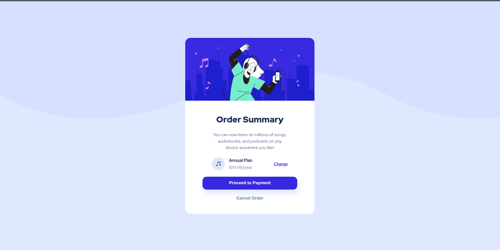

# Frontend Mentor - Order summary card solution

This is a solution to the [Order summary card challenge on Frontend Mentor](https://www.frontendmentor.io/challenges/order-summary-component-QlPmajDUj). Frontend Mentor challenges help you improve your coding skills by building realistic projects.

## Table of contents

- [Overview](#overview)
  - [The challenge](#the-challenge)
  - [Screenshot](#screenshot)
  - [Links](#links)
- [My process](#my-process)
  - [Built with](#built-with)
  - [What I learned](#what-i-learned)
- [Author](#author)

## Overview

### The challenge

Users should be able to:

- See hover states for interactive elements

### Screenshot

### Links

- Solution URL: [GitHub Repo](https://github.com/Swat801/order-summary)
- Live Site URL: [Live View](https://order-summary-ten-delta.vercel.app/)

## My process

### Built with

- Semantic HTML5 markup
- CSS custom properties
- Flexbox
- Google Fonts (Red Hat Display)

### What I learned

This project helped me practice and reinforce the following:

- Creating centered layouts using Flexbox
- Using CSS variables for consistent color theming
- Handling hover states for buttons
- Structuring HTML semantically

## Author

- GitHub – [@shashwatsingh](https://github.com/Swat801)
